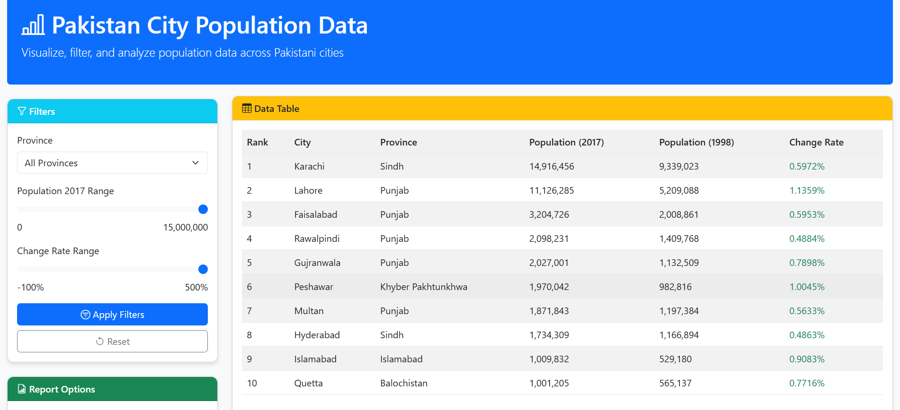
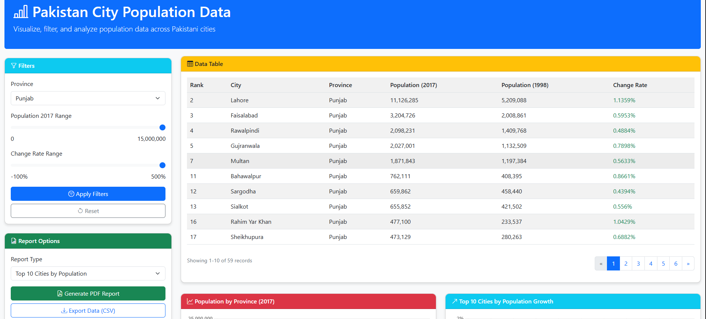
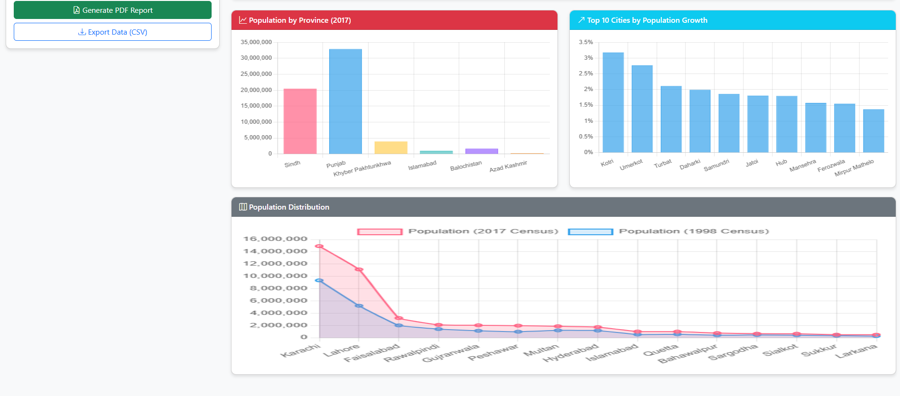

# Population-Growth-Analysis

This project is a web application designed to visualize the population growth of Pakistani cities from 1998 to 2017. It provides an interactive and user-friendly interface to explore population trends and analyze growth patterns over the years.

## Features

- **Interactive Visualizations**: View population data through charts and graphs.
- **City-wise Analysis**: Select specific cities to analyze their population growth.
- **Time Range Selection**: Focus on specific years within the 1998-2017 range.
- **Responsive Design**: Accessible on both desktop and mobile devices.

## Results
## Results

Here are some visualizations generated by the project:


*Figure 1: Population growth trends over the years.*


*Figure 2: City-wise population analysis.*


*Figure 3: Some charts and graphs showing different results about the data.*


## How It Works

1. **Data Source**: The application uses population data from official census records.
2. **Visualization**: Data is processed and displayed using modern web technologies like JavaScript and charting libraries.
3. **User Interaction**: Users can filter, zoom, and interact with the visualizations to gain insights.

## Installation and Setup

1. Clone the repository:
    ```bash
    git clone https://github.com/your-username/Population-Growth-Analysis.git
    ```
2. Navigate to the project directory:
    ```bash
    cd Population-Growth-Analysis
    ```
3. Install dependencies:
    ```bash
    npm install
    ```
4. Start the development server:
    ```bash
    npm start
    ```
5. Open your browser and visit `http://localhost:3000`.

## Technologies Used

- **Frontend**: HTML, CSS, JavaScript, React.js
- **Backend**: Node.js, Express.js
- **Data Visualization**: Chart.js, D3.js
- **Database**: MongoDB

## Contributing

Contributions are welcome! Please fork the repository and submit a pull request with your changes.

## Authors
- [Abdul Lahad]()
- [Uzair Hussain]()
- [Mirza Muhammad Abbas]()
- [Muhammad Razi]()
